# THUC_HANH_NHAP_MON_XU_LY_ANH_SO
Phạm Thanh Sang - 2174802010561
#3. Bài tập
#Câu 1: Viết chương trình nạp một ảnh và lưu thành 3 ảnh với 3 màu khác nhau:
Nạp các thư viện cần thiết
numpy: Thư viện hỗ trợ xử lý ma trận (dữ liệu ảnh dưới dạng mảng số).

imageio.v2: Dùng để đọc và lưu ảnh từ file.

matplotlib.pyplot: Dùng để hiển thị ảnh.
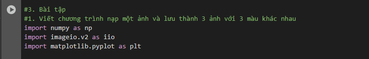

Đọc ảnh 'bird.png' từ file và lưu vào biến a (dưới dạng mảng 3 chiều: cao x rộng x 3 kênh màu RGB).
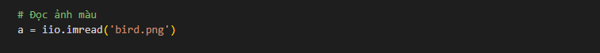

Tạo 3 bản sao của ảnh gốc để xử lý từng kênh màu Đỏ (Red), Xanh lá (Green) và Xanh dương (Blue).
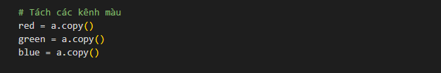

Giữ lại kênh Red, đặt giá trị kênh Green và Blue bằng 0.
Giữ lại kênh Green, đặt giá trị kênh Red và Blue bằng 0.
Giữ lại kênh Blue, đặt giá trị kênh Red và Green bằng 0.
Lưu từng ảnh với kênh màu riêng vào file mới (bird_red.png, bird_green.png, bird_blue.png).
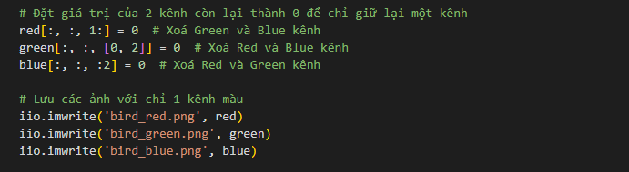

Tạo khung hiển thị ảnh với kích thước 10x5 inch.
Hiển thị ảnh kênh Red trong ô thứ nhất, tắt trục tọa độ.
Hiển thị ảnh kênh Green và Blue 
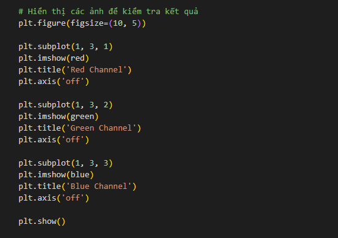

Kết quả:
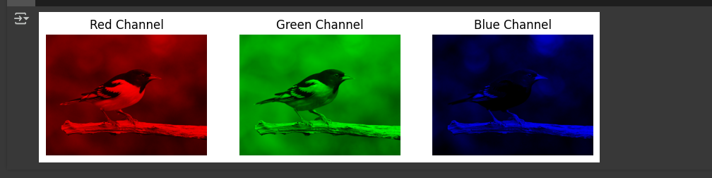

Ảnh gốc: Là ảnh màu bird.png có đầy đủ 3 kênh màu Red, Green và Blue.

Ảnh Red (bird_red.png):

Chỉ giữ lại kênh Red (màu đỏ) của ảnh gốc.

Các chi tiết ảnh chỉ hiện màu đỏ, các kênh xanh lá và xanh dương được loại bỏ (thành màu đen).

Ảnh Green (bird_green.png):

Chỉ giữ lại kênh Green (màu xanh lá) của ảnh gốc.

Các chi tiết ảnh chỉ hiện màu xanh lá, các kênh đỏ và xanh dương được loại bỏ (thành màu đen).

Ảnh Blue (bird_blue.png):

Chỉ giữ lại kênh Blue (màu xanh dương) của ảnh gốc.

Các chi tiết ảnh chỉ hiện màu xanh dương, các kênh đỏ và xanh lá được loại bỏ (thành màu đen).

Câu 2: Viết chương trinh nạp mộta nhr và hoán đổei giá trị các màu. Lưu các ảnh vào máy
import các thư viện cần thiết
numpy: Xử lý mảng dữ liệu ảnh.

imageio.v2: Đọc và ghi ảnh từ file.

matplotlib.pyplot: Hiển thị ảnh.
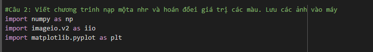

Đọc ảnh
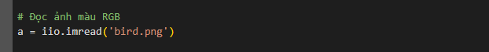

Hoán đổi kênh màu Red & Green:
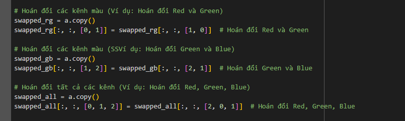
copy() được dùng để sao chép dữ liệu gốc, tránh thay đổi ảnh ban đầu.
Đổi vị trí giá trị ở kênh 0 (Red) và 1 (Green) cho mọi pixel.
Kết quả: Màu đỏ và xanh lá của ảnh sẽ hoán đổi, tạo ra hiệu ứng màu sắc lạ.
Hoán đổi Green & Blue
Đổi vị trí giá trị kênh 1 (Green) và 2 (Blue).
Hoán đổi tất cả kênh (Red → Green, Green → Blue, Blue → Red)
Đổi vị trí toàn bộ kênh màu:
Kênh 0 (Red) lấy giá trị từ Blue,
Kênh 1 (Green) lấy giá trị từ Red,
Kênh 2 (Blue) lấy giá trị từ Green.

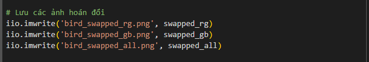
Lưu 3 ảnh kết quả với tên mới.

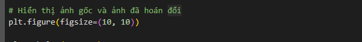
Tạo khung hình có kích thước 10x10 inch.
Hiển thị ảnh gốc

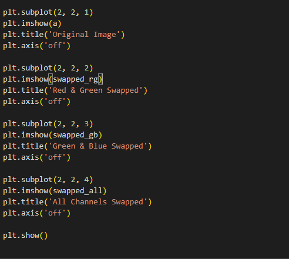
Hiển thị ảnh đã hoán đổi màu
Hiển thị toàn bộ hình ảnh

Kết quả:
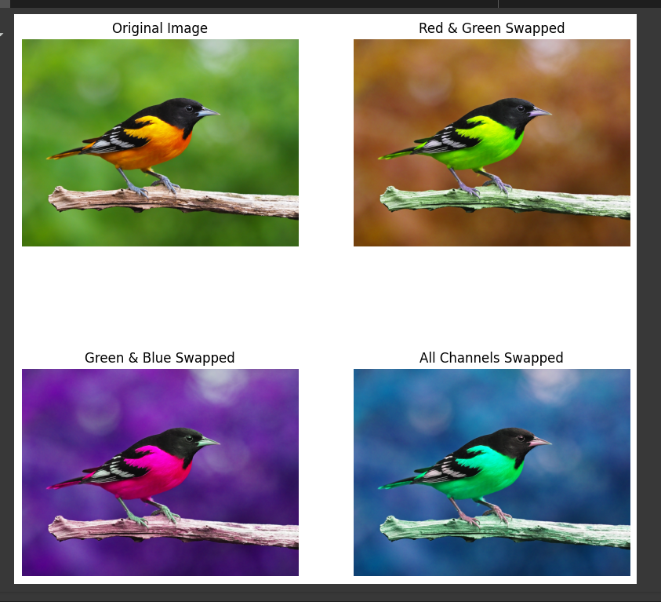
1. Original Image (Ảnh gốc)
Đây là ảnh bird.png gốc, chứa đầy đủ 3 kênh màu Red (Đỏ), Green (Xanh lá) và Blue (Xanh dương).
2. Red & Green Swapped (bird_swapped_rg.png)
Kênh Red (Đỏ) và Green (Xanh lá) đã hoán đổi vị trí.
Vùngnào trong ảnh vốn màu đỏ sẽ trở thành xanh lá.
Vùng nào vốn màu xanh lá sẽ chuyển thành đỏ.
3. Green & Blue Swapped (bird_swapped_gb.png)
Kênh Green (Xanh lá) và Blue (Xanh dương) đã hoán đổi vị trí.
Vùng màu xanh lá trở thành xanh dương.
Vùng màu xanh dương trở thành xanh lá.
4. All Channels Swapped (bird_swapped_all.png)
Toàn bộ các kênh màu Red, Green, Blue bị hoán đổi theo thứ tự Red → Green, Green → Blue, Blue → Red.
Tất cả màu sắc sẽ bị thay đổi hoàn toàn, tạo nên hiệu ứng màu không tự nhiên và thú vị.
#Câu 3: Viết chương trình nạp một ảnh, chuyển thành hệ màu HSV và lưu 3 ảnh với 3 màu khác nhau.
