# THUC_HANH_NHAP_MON_XU_LY_ANH_SO
Phạm Thanh Sang - 2174802010561

BÀI TẬP LAB 1
----------------------------------------------------
Câu 1: Viết chương trình nạp một ảnh và lưu thành 3 ảnh với 3 màu khác nhau:

Nạp các thư viện cần thiết

numpy: Thư viện hỗ trợ xử lý ma trận (dữ liệu ảnh dưới dạng mảng số).

imageio.v2: Dùng để đọc và lưu ảnh từ file.

matplotlib.pyplot: Dùng để hiển thị ảnh.

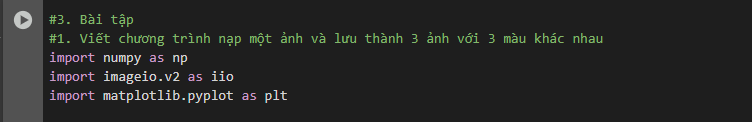

Đọc ảnh 'bird.png' từ file và lưu vào biến a (dưới dạng mảng 3 chiều: cao x rộng x 3 kênh màu RGB).

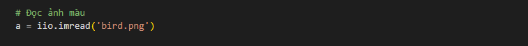

Tạo 3 bản sao của ảnh gốc để xử lý từng kênh màu Đỏ (Red), Xanh lá (Green) và Xanh dương (Blue).

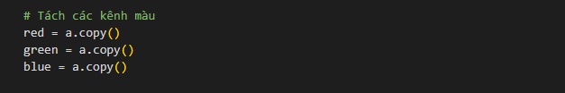

Giữ lại kênh Red, đặt giá trị kênh Green và Blue bằng 0.

Giữ lại kênh Green, đặt giá trị kênh Red và Blue bằng 0.

Giữ lại kênh Blue, đặt giá trị kênh Red và Green bằng 0.

Lưu từng ảnh với kênh màu riêng vào file mới (bird_red.png, bird_green.png, bird_blue.png).

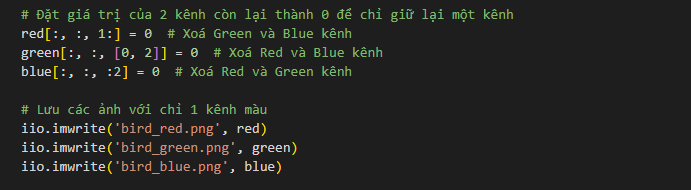

Tạo khung hiển thị ảnh với kích thước 10x5 inch.

Hiển thị ảnh kênh Red trong ô thứ nhất, tắt trục tọa độ.

Hiển thị ảnh kênh Green và Blue 

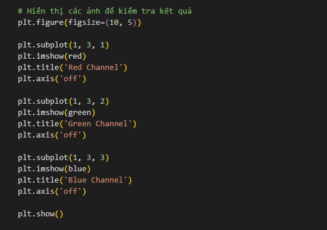

Kết quả:

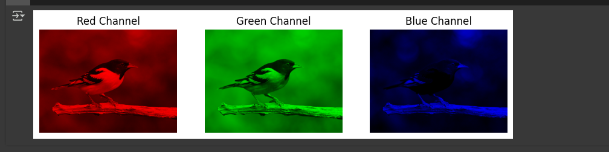

Ảnh gốc: Là ảnh màu bird.png có đầy đủ 3 kênh màu Red, Green và Blue.

Ảnh Red (bird_red.png):

Chỉ giữ lại kênh Red (màu đỏ) của ảnh gốc.

Các chi tiết ảnh chỉ hiện màu đỏ, các kênh xanh lá và xanh dương được loại bỏ (thành màu đen).

Ảnh Green (bird_green.png):

Chỉ giữ lại kênh Green (màu xanh lá) của ảnh gốc.

Các chi tiết ảnh chỉ hiện màu xanh lá, các kênh đỏ và xanh dương được loại bỏ (thành màu đen).

Ảnh Blue (bird_blue.png):

Chỉ giữ lại kênh Blue (màu xanh dương) của ảnh gốc.

Các chi tiết ảnh chỉ hiện màu xanh dương, các kênh đỏ và xanh lá được loại bỏ (thành màu đen).

-----------------------------------------------------------
Câu 2: Viết chương trinh nạp một ảnh và hoán đổi giá trị các màu. Lưu các ảnh vào máy

import các thư viện cần thiết

numpy: Xử lý mảng dữ liệu ảnh.

imageio.v2: Đọc và ghi ảnh từ file.

matplotlib.pyplot: Hiển thị ảnh.

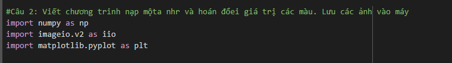

Đọc ảnh

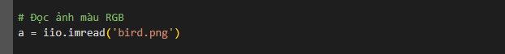

Hoán đổi kênh màu Red & Green:

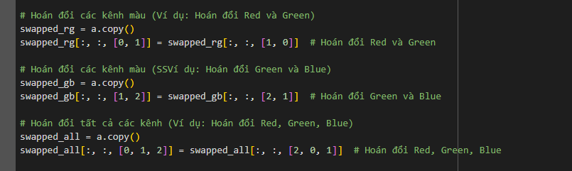

copy() được dùng để sao chép dữ liệu gốc, tránh thay đổi ảnh ban đầu.

Đổi vị trí giá trị ở kênh 0 (Red) và 1 (Green) cho mọi pixel.

Kết quả: Màu đỏ và xanh lá của ảnh sẽ hoán đổi, tạo ra hiệu ứng màu sắc lạ.

Hoán đổi Green & Blue

Đổi vị trí giá trị kênh 1 (Green) và 2 (Blue).

Hoán đổi tất cả kênh (Red → Green, Green → Blue, Blue → Red)

Đổi vị trí toàn bộ kênh màu:

Kênh 0 (Red) lấy giá trị từ Blue,

Kênh 1 (Green) lấy giá trị từ Red,

Kênh 2 (Blue) lấy giá trị từ Green.

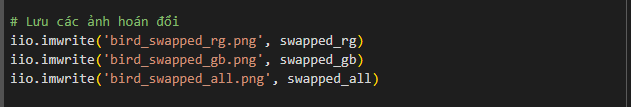

Lưu 3 ảnh kết quả với tên mới.

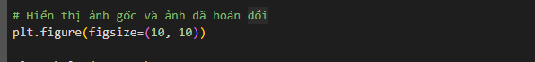

Tạo khung hình có kích thước 10x10 inch.
Hiển thị ảnh gốc

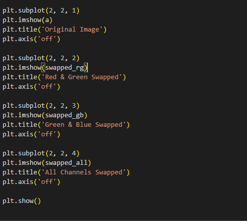

Hiển thị ảnh đã hoán đổi màu

Hiển thị toàn bộ hình ảnh

Kết quả:

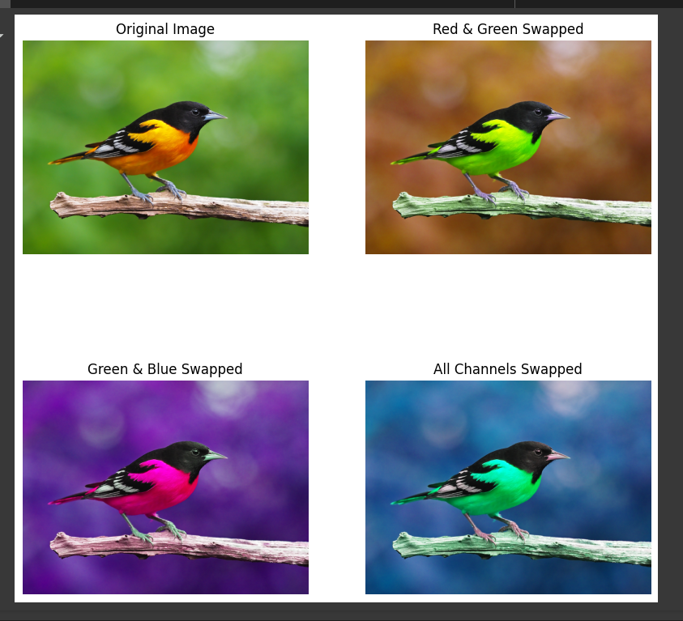

1. Original Image (Ảnh gốc)

Đây là ảnh bird.png gốc, chứa đầy đủ 3 kênh màu Red (Đỏ), Green (Xanh lá) và Blue (Xanh dương).

2. Red & Green Swapped (bird_swapped_rg.png)

Kênh Red (Đỏ) và Green (Xanh lá) đã hoán đổi vị trí.

Vùngnào trong ảnh vốn màu đỏ sẽ trở thành xanh lá.

Vùng nào vốn màu xanh lá sẽ chuyển thành đỏ.

3. Green & Blue Swapped (bird_swapped_gb.png)

Kênh Green (Xanh lá) và Blue (Xanh dương) đã hoán đổi vị trí.

Vùng màu xanh lá trở thành xanh dương.

Vùng màu xanh dương trở thành xanh lá.

4. All Channels Swapped (bird_swapped_all.png)

Toàn bộ các kênh màu Red, Green, Blue bị hoán đổi theo thứ tự Red → Green, Green → Blue, Blue → Red.

Tất cả màu sắc sẽ bị thay đổi hoàn toàn, tạo nên hiệu ứng màu không tự nhiên và thú vị.

-----------------------------------------------------------
#Câu 3: Viết chương trình nạp một ảnh, chuyển thành hệ màu HSV và lưu 3 ảnh với 3 màu khác nhau.

Nạp các thư viện cần thiết

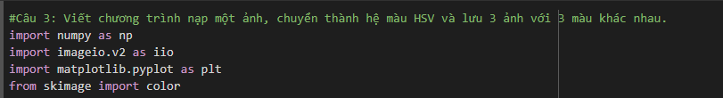

NumPy (numpy): Dùng để xử lý dữ liệu mảng số (ảnh).

ImageIO (imageio.v2): Dùng để nạp ảnh (imread) và lưu ảnh (imwrite) với định dạng .png, .jpg.

Matplotlib (matplotlib.pyplot): Hiển thị ảnh trực quan, so sánh giữa ảnh gốc và ảnh đã tách kênh.

Scikit-Image (skimage.color): Chuyển đổi hệ màu từ RGB (Red-Green-Blue) sang HSV (Hue-Saturation-Value).

Đọc ảnh

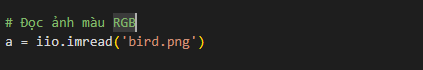

 Chuyển ảnh từ hệ màu RGB sang HSV

 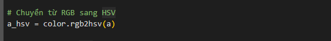

 Ảnh a được chuyển đổi từ hệ màu RGB (Red, Green, Blue) sang HSV (Hue, Saturation, Value) nhờ hàm rgb2hsv.

 H (Hue): Tông màu chính (0–1), ví dụ 0 = đỏ, 0.33 = xanh lá, 0.66 = xanh dương.

S (Saturation): Độ bão hòa màu (0–1), càng gần 1 màu càng rực rỡ.

V (Value): Độ sáng (0–1), càng gần 1 càng sáng.

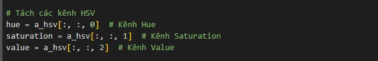

Hue: Chứa thông tin màu chính.

Saturation: Chứa thông tin độ bão hòa.

Value: Chứa thông tin độ sáng.

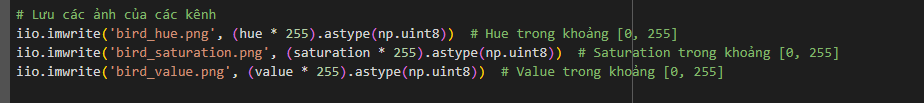

Lưu từng kênh màu HSV thành ảnh riêng

Nhân với 255: Vì giá trị Hue, Saturation, Value gốc nằm trong khoảng [0,1], ta nhân 255 để đưa về [0,255] để lưu ảnh 8-bit.

Chuyển kiểu dữ liệu (astype(np.uint8)): Đảm bảo dữ liệu hợp lệ để lưu dưới dạng ảnh PNG.

 Hiển thị ảnh gốc và từng kênh màu

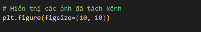

Tạo khung hình kích thước lớn (10x10 inch).

Hiển thị ảnh gốc RGB

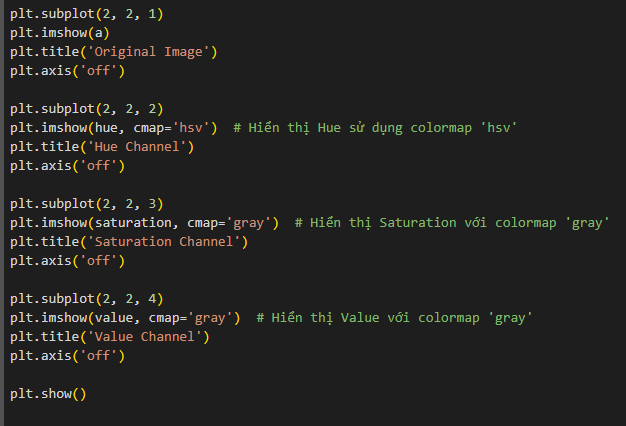

Hiển thị Hue với colormap 'hsv'

Hiển thị Saturation với colormap 'gray'

Hiển thị Value với colormap 'gray'

Sau đó plt.shpw Hiển thị toàn bộ hình ảnh

Kết quả:

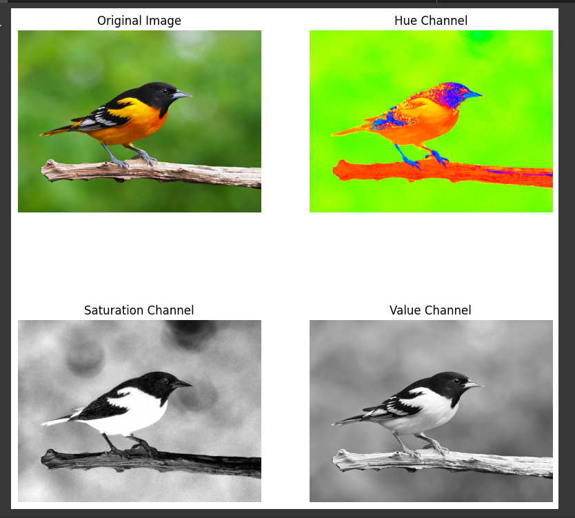

Sau khi chạy, ta thu được 4 ảnh:

Original Image: Ảnh gốc RGB (tự nhiên).

Hue Channel (bird_hue.png):

Mỗi pixel biểu diễn tông màu chính (0–1).

Vùng đỏ → giá trị gần 0, vùng xanh → khoảng 0.33, vùng xanh dương → khoảng 0.66.

Colormap 'hsv' giúp ta nhìn thấy màu như bánh xe màu.

Saturation Channel (bird_saturation.png):

Hiển thị độ bão hòa màu (0–1).

Vùng màu đậm → sáng (giá trị cao), vùng nhạt/đen trắng → tối (giá trị thấp).

Colormap 'gray': sáng hơn = bão hòa hơn.

Value Channel (bird_value.png):

Hiển thị độ sáng (0–1).

Vùng sáng → pixel sáng hơn, vùng tối → pixel tối hơn.

----------------------------------------------------------
Câu 4: Viết chương trình nạp ảnh, chuyển sang hệ màu HSV. Lưu ảnh mới với kênh Hnew = 1/3 Hold, Vnew = 3/4 Vold

Nạp các thư viện cần thiết

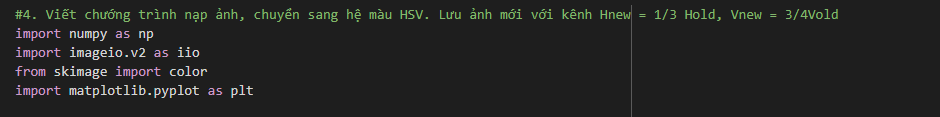

NumPy (numpy): Xử lý dữ liệu dạng mảng.

ImageIO (imageio.v2): Đọc và lưu ảnh định dạng PNG/JPG.

Scikit-Image (skimage.color): Chuyển đổi hệ màu RGB ↔ HSV.

Matplotlib (matplotlib.pyplot): Hiển thị ảnh trực quan.

Đọc ảnh

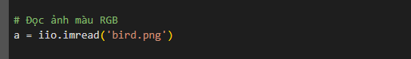

Chuyển từ RGB sang HSV

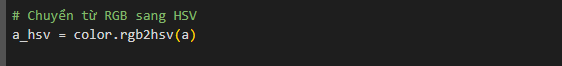

Hàm rgb2hsv chuyển ảnh từ hệ màu RGB sang HSV.

HSV là hệ màu dựa trên cách mắt người cảm nhận:

Hue (H): Tông màu (0–1)

Saturation (S): Độ bão hòa (0–1)

Value (V): Độ sáng (0–1)

Tách các kênh H, S, V

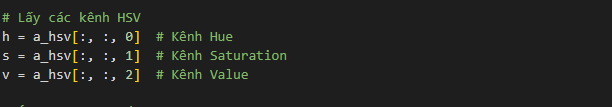

Biến đổi các kênh H và V

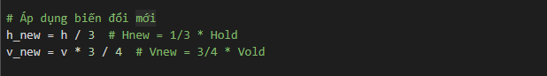

Biến đổi Hue (H): Giảm tông màu của toàn bộ ảnh, khiến màu sắc có xu hướng dịu hơn (giảm độ rực của màu gốc).

Biến đổi Value (V): Giảm độ sáng, làm ảnh tối hơn.

Đảm bảo giá trị Hnew và Vnew nằm trong [0, 1]

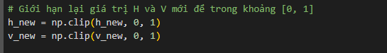

Hàm np.clip giữ giá trị nằm trong khoảng [0,1] để ảnh hợp lệ.

Tạo ảnh HSV mới và chuyển về RGB

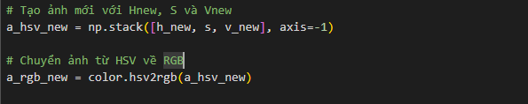

Ghép kênh Hnew, S, Vnew tạo ảnh HSV mới.

Chuyển ảnh HSV trở lại RGB để có thể hiển thị và lưu.

Lưu ảnh mới

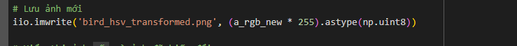

Nhân a_rgb_new với 255 để chuyển về khoảng [0,255].

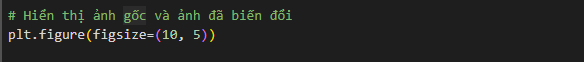

Chuyển kiểu dữ liệu về uint8 để lưu ảnh PNG.

Hiển thị ảnh gốc và ảnh đã biến đổi

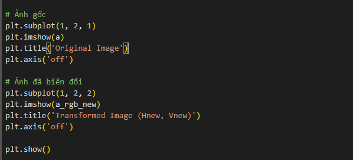

Kết quả

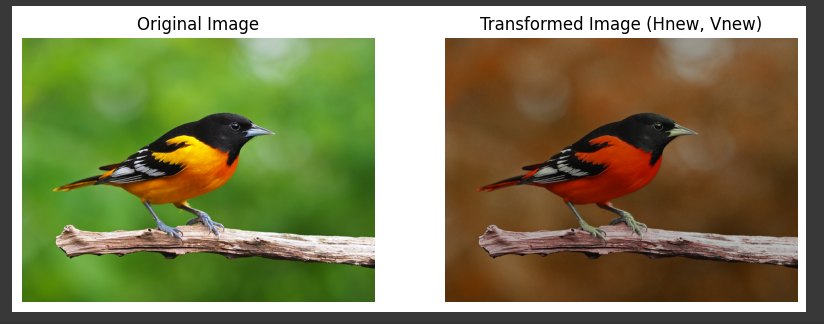

Ảnh bên trái: ảnh gốc RGB.

Ảnh bên phải: ảnh đã biến đổi với kênh H = 1/3 H và V = 3/4 V.

-----------------------------------------------------------------------------------
BÀI TẬP LAB 2

Câu 1: 
Chương trình này cung cấp một menu cho phép người dùng chọn và thực hiện các phép biến đổi ảnh cơ bản, bao gồm:

Biến đổi ảnh ngược (Image Inverse Transformation)

Biến đổi Gamma (Gamma Correction)

Biến đổi Log (Log Transformation)

Cân bằng Histogram (Histogram Equalization)

Người dùng có thể chọn phương pháp biến đổi ảnh thông qua menu và chương trình sẽ hiển thị kết quả sau mỗi phép biến đổi.

Chương trình sử dụng các thư viện sau:
PIL (Python Imaging Library)

numpy

imageio

matplotlib

scipy

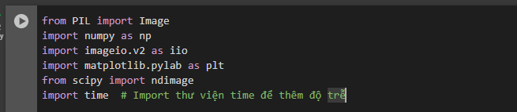
Hình 1: Import các thư viện cần thiết

Cách Sử Dụng
Chuẩn Bị Ảnh:

Đảm bảo bạn có một ảnh đầu vào hợp lệ. Bạn có thể thay thế đường dẫn ảnh trong mã bằng đường dẫn ảnh của bạn.

Chạy Chương Trình:

Sau khi chơng trình chạy, nó sẽ yêu cầu bạn nhập lựa chọn từ menu để áp dụng một trong các phép biến đổi ảnh.

Lựa Chọn Phương Pháp Biến Đổi:

Chương trình cung cấp một menu với các lựa chọn sau:

F – Biến đổi ảnh ngược (Image Inverse Transformation)

G – Biến đổi Gamma (Gamma Correction)

L – Biến đổi Log (Log Transformation)

H – Cân bằng histogram (Histogram Equalization)

C – Thoát chương trình

Hiển Thị Kết Quả:

Sau khi thực hiện mỗi phép biến đổi, chương trình sẽ hiển thị kết quả ảnh đã thay đổi.

Thoát Chương Trình:

Khi chọn "C", chương trình sẽ thoát khỏi vòng lặp và kết thúc.

------
Hàm Biến Đổi Ảnh Ngược (Image Inverse Transformation)

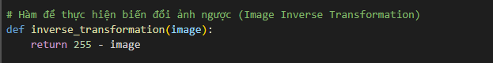

Phép biến đổi ảnh ngược sẽ đổi giá trị pixel của ảnh. Mọi pixel sáng (255) sẽ chuyển thành tối (0), và ngược lại.

-------
Hàm Biến Đổi Gamma (Gamma Correction)

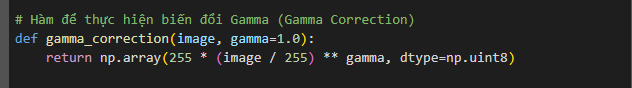

Biến đổi Gamma làm thay đổi độ sáng của ảnh. Nếu Gamma > 1, ảnh sẽ sáng hơn; nếu Gamma < 1, ảnh sẽ tối đi.

------
Hàm Biến Đổi Log (Log Transformation)

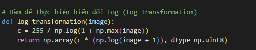

Biến đổi Log giúp tăng cường các chi tiết trong các vùng tối của ảnh bằng cách áp dụng hàm logarit.

------
Hàm Cân Bằng Histogram (Histogram Equalization)

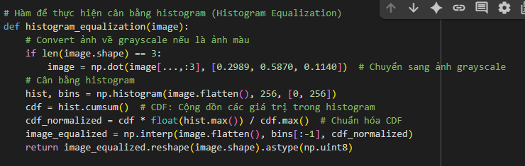

Cân bằng histogram cải thiện độ tương phản của ảnh bằng cách phân bố lại các giá trị pixel trong ảnh.

-----
Hàm Hiển Thị Ảnh

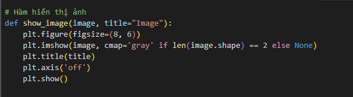

-----
Main

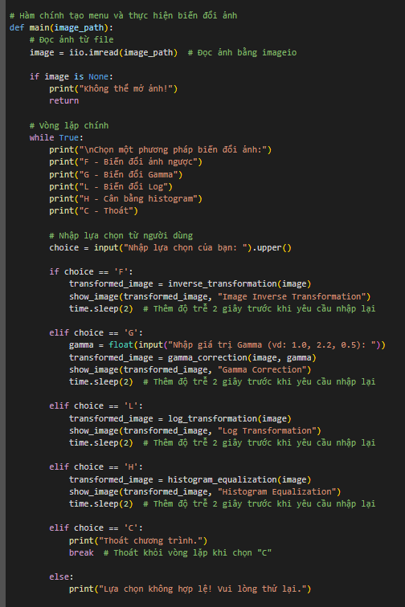

Hàm này chính là vòng lặp menu chính, nơi người dùng nhập lựa chọn để thực hiện các phép biến đổi ảnh.

Sau mỗi phép biến đổi, ảnh được hiển thị và chương trình sẽ tiếp tục yêu cầu người dùng chọn phép biến đổi khác hoặc thoát chương trình.

-----
Kết quả

Biến Đổi Ảnh Ngược: Sau khi thực hiện, các pixel của ảnh sẽ bị đảo ngược. Ví dụ, pixel có giá trị 0 sẽ thành 255 và ngược lại.

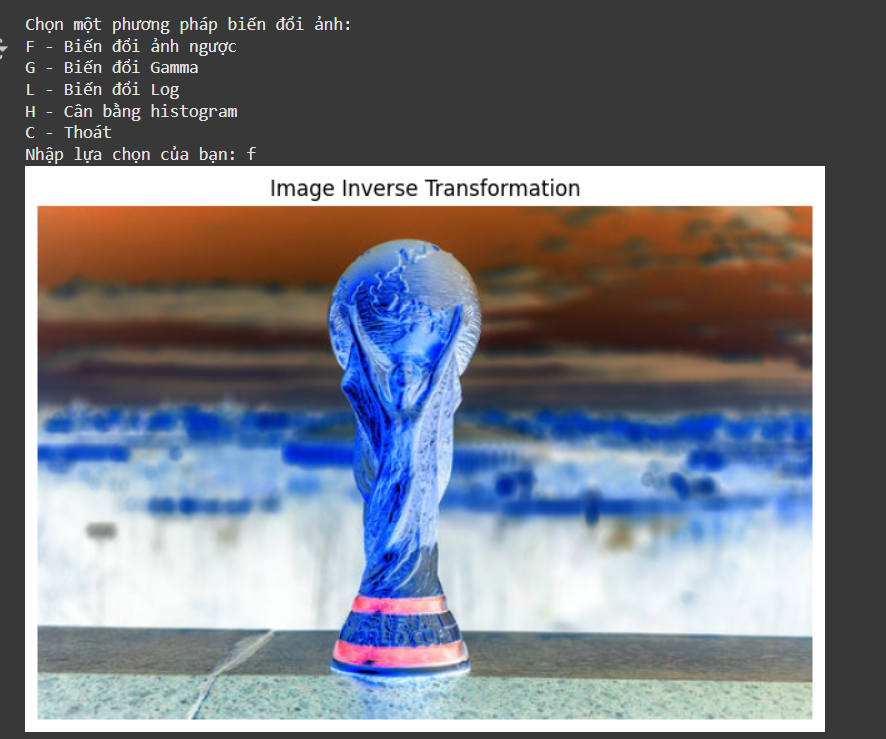

Biến Đổi Gamma: Tùy vào giá trị Gamma, ảnh sẽ sáng hơn hoặc tối hơn. Ví dụ, với Gamma = 1.5, ảnh sẽ sáng lên.

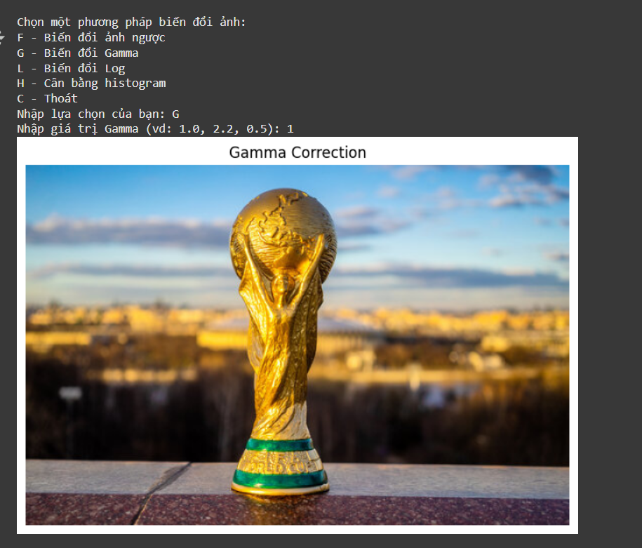

Cân Bằng Histogram: Làm tăng cường độ tương phản cho ảnh, đặc biệt đối với các ảnh có độ sáng tối không đều.

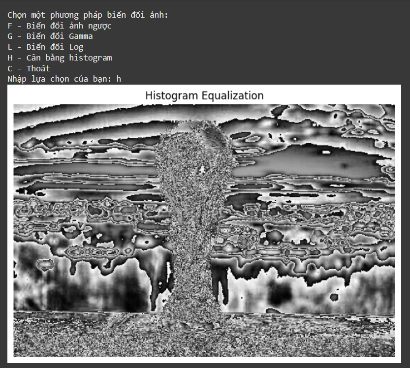

--------------------------------------------------------------------------------------------------
Câu 2: Viết chương trình tạo menu cho phép người dùng chọn các phương pháp biến đổi ảnh như sau:

   * Biến đổi Fourier (Fast Fourier)
   * Bộ lọc Butterworth Lowpass (Butterworth Lowpass Filter)
   * Bộ lọc Butterworth Highpass (Butterworth Highpass Filter)

   Khi người dùng nhập các phím F, L, H, chương trình sẽ thực hiện những phương pháp biến đổi tương ứng trong mục exercise. Lưu ý hiển thị ảnh và các biến đổi.

Chương trình này cho phép người dùng thực hiện các phép biến đổi ảnh cơ bản bằng cách sử dụng các bộ lọc Butterworth Lowpass và Butterworth Highpass, cũng như biến đổi Fourier để chuyển ảnh vào không gian tần số. Người dùng có thể chọn phương pháp biến đổi ảnh thông qua một menu tương tác.

Các chức năng chính của chương trình bao gồm:

Biến đổi Fourier: Chuyển ảnh sang không gian tần số và hiển thị độ lớn của tần số.

Bộ lọc Butterworth Lowpass: Loại bỏ các tần số cao và làm mờ ảnh.

Bộ lọc Butterworth Highpass: Loại bỏ các tần số thấp và làm nổi bật các chi tiết ảnh

------
Cách Sử Dụng
Chuẩn Bị Ảnh:

Đảm bảo bạn có một ảnh đầu vào hợp lệ. Bạn có thể thay thế đường dẫn ảnh trong mã bằng đường dẫn ảnh của bạn.

Chạy Chương Trình:
Chọn Phương Pháp Biến Đổi:

Sau khi chương trình chạy, nó sẽ yêu cầu bạn nhập lựa chọn từ menu để thực hiện một trong các phép biến đổi ảnh:

1 – Biến đổi Fourier (Fast Fourier Transform)

2 – Bộ lọc Butterworth Lowpass

3 – Bộ lọc Butterworth Highpass

4 – Thoát chương trình

Nhập Giá Trị cutoff:

Nếu bạn chọn bộ lọc Butterworth Lowpass hoặc Butterworth Highpass, chương trình sẽ yêu cầu bạn nhập giá trị cutoff (tần số cắt) trong khoảng từ 0.1 đến 0.5.

Hiển Thị Kết Quả:

Sau khi thực hiện mỗi phép biến đổi, chương trình sẽ hiển thị ảnh đã biến đổi.

Thoát Chương Trình:

Chọn 4 để thoát chương trình.

------
các thư viện cần thiết

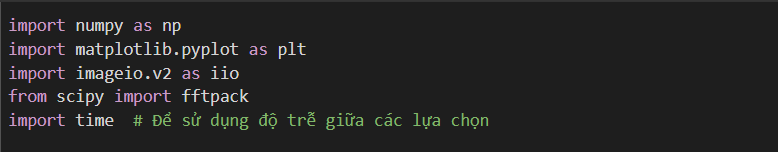

numpy giúp xử lý các mảng số học.

scipy.fftpack được dùng để thực hiện phép biến đổi Fourier (FFT).

imageio dùng để đọc ảnh vào chương trình.

matplotlib.pyplot dùng để hiển thị ảnh.

time giúp thêm độ trễ giữa các thao tác trong chương trình.

-----
Hàm Biến Đổi Fourier (FFT)

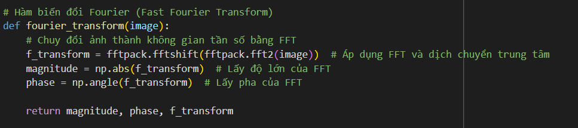

Hàm này thực hiện Biến đổi Fourier (FFT) và trả về:

Độ lớn của tần số.

Pha của các tần số.

Biến đổi Fourier của ảnh.

-----
Hàm Bộ Lọc Butterworth Lowpass

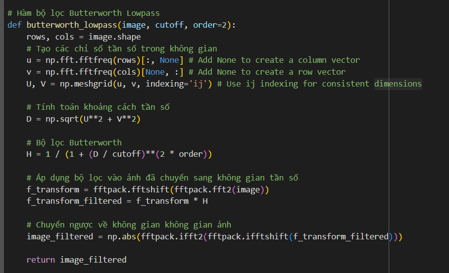

Bộ lọc Butterworth Lowpass làm mờ ảnh bằng cách loại bỏ các tần số cao hơn cutoff.

-----
Hàm Bộ Lọc Butterworth Highpass

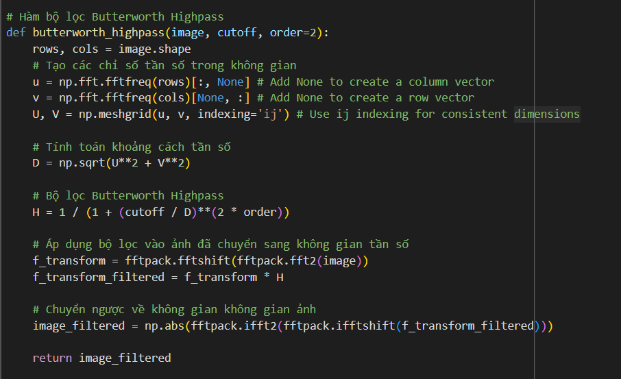

Bộ lọc Butterworth Highpass loại bỏ các tần số thấp hơn cutoff, làm nổi bật các chi tiết ảnh.

-----
Hàm Hiển Thị Ảnh

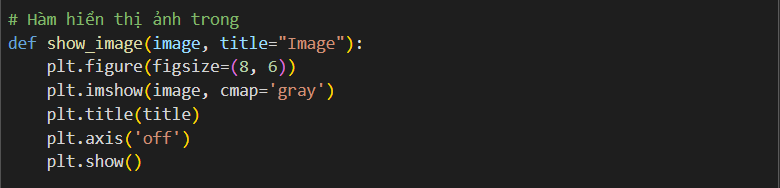

------
Hàm Kiểm Tra và Nhập Giá Trị cutoff

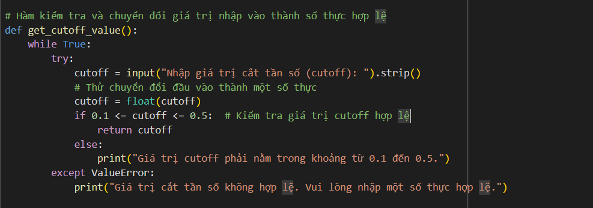

Hàm này giúp người dùng nhập giá trị cutoff (tần số cắt) cho bộ lọc Butterworth Lowpass và Highpass, đảm bảo giá trị nhập vào là hợp lệ và trong phạm vi từ 0.1 đến 0.5.

------
Hàm chính tạo menu và thực hiện biến đổi ảnh

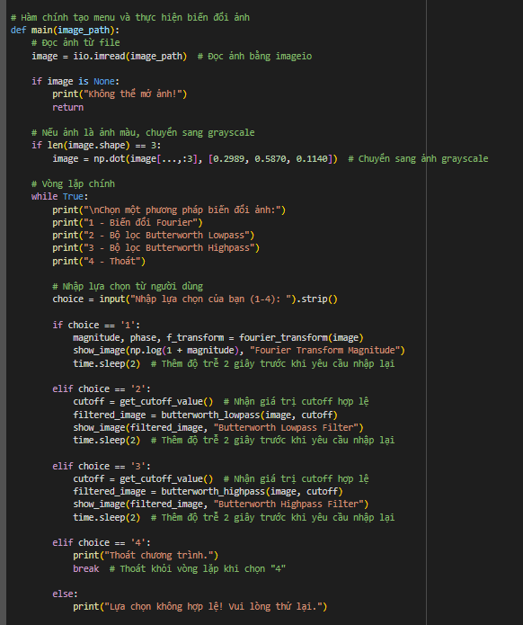

Hàm này là vòng lặp chính của chương trình, cho phép người dùng chọn các phương pháp biến đổi ảnh và hiển thị kết quả.

-------
Kết Quả
Biến Đổi Fourier: Ảnh sẽ được chuyển sang không gian tần số và hiển thị độ lớn của các tần số. Bạn sẽ thấy các tần số cao ở các vùng ngoài cùng và các tần số thấp ở trung tâm.

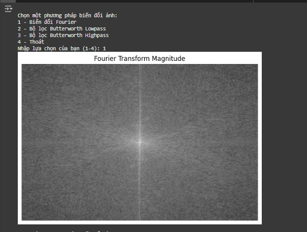

Bộ Lọc Butterworth Lowpass: Ảnh sẽ bị mờ đi vì các tần số cao bị loại bỏ.

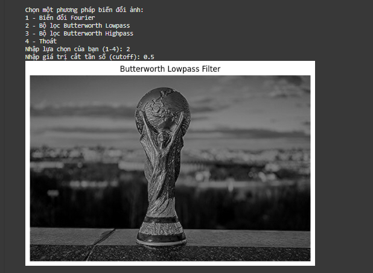

Bộ Lọc Butterworth Highpass: Các chi tiết ảnh sẽ trở nên rõ ràng hơn, vì tần số thấp bị loại bỏ.

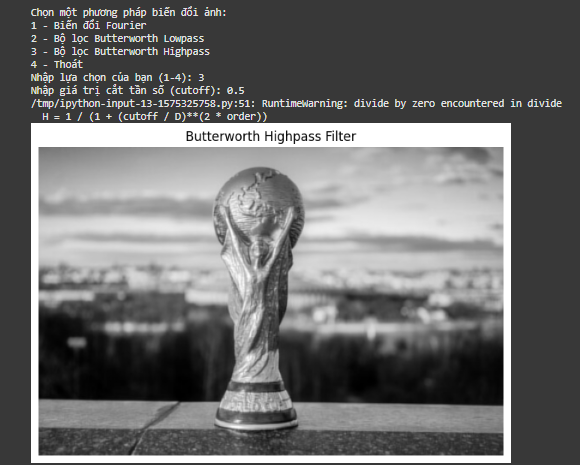

------------------------------------------------------------------------------------------------
Câu 3: Viết chương trình thay đổi tự màu RGB của ảnh trong mục exercise và sử dụng ngẫu nhiên một trong các phép biến đổi ảnh trên trong câu 1. Lưu và hiển thị ảnh biến đổi ngẫu nhiên

Import các thư viện cần thiết
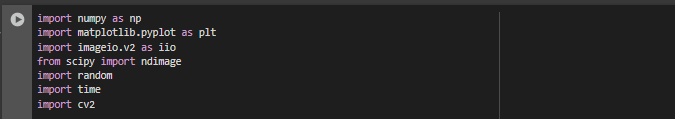

Phép biến đổi này sẽ đảo ngược màu sắc của ảnh (màu sáng thành tối và ngược lại).

-----
Hàm Thay Đổi Tự Màu RGB của Ảnh

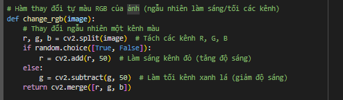

Thay đổi tự màu RGB của ảnh bằng cách làm sáng hoặc tối ngẫu nhiên các kênh màu (Red, Green, Blue).

----
Hàm Bộ Lọc Min và Max

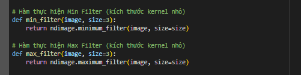

Min Filter: Làm mờ ảnh bằng cách thay thế giá trị pixel bằng giá trị nhỏ nhất trong một vùng lân cận.

Max Filter: Làm nổi bật các chi tiết trong ảnh bằng cách thay thế giá trị pixel bằng giá trị lớn nhất trong một vùng lân cận.

-----
 Hàm chính tạo menu và thực hiện biến đổi ảnh

 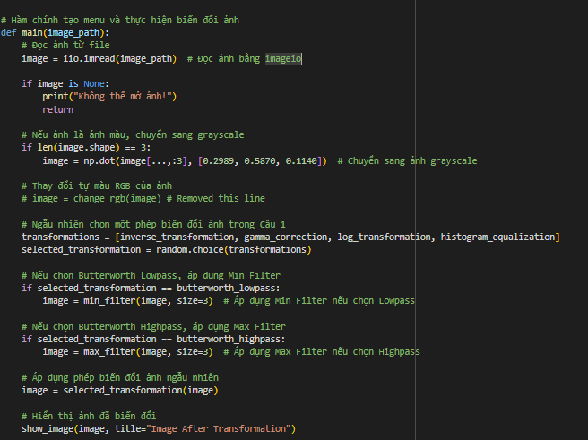

 ----
 Kết Quả
 Thực hiện với ảnh pagoda.jpg

 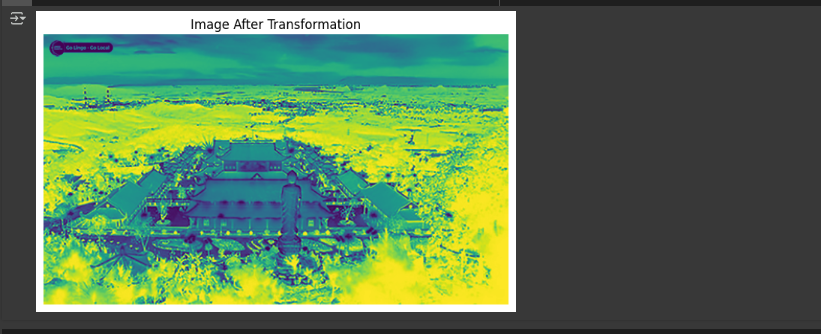

----------------------------------------------------------------------------------------------
Câu 4: Viết chương trình thay đổi tự màu RGB của ảnh trong mục exercise và sử dụng ngẫu nhiên một trong các phép biến đổi ảnh trong câu 2. Nếu ngẫu nhiên là phép Butterworth Lowpass thì chọn phép Min Filter để lọc ảnh. Nếu ngẫu nhiên chọn phép Butterworth Highpass thì chọn phép Max Filter để lọc ảnh. Lưu ý hiển thị ảnh đã biến đổi.

Import các thư viện cần thiết

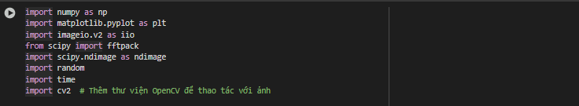

-----
Biến Đổi Fourier (FFT)

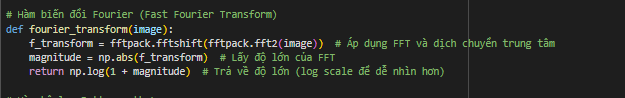

Biến đổi Fourier giúp chuyển ảnh từ không gian không gian sang không gian tần số, từ đó ta có thể phân tích các tần số trong ảnh. Chương trình sử dụng log scale để hiển thị rõ hơn các tần số.

-----
Bộ Lọc Butterworth Lowpass

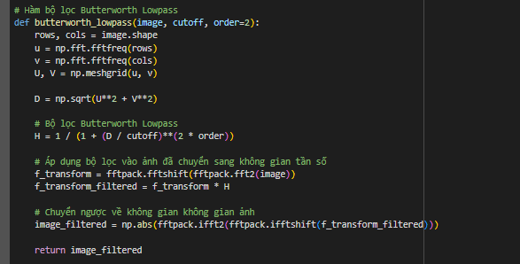

-----
Bộ Lọc Butterworth Highpass

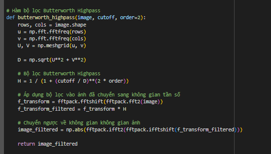

-----
Hàm Thay Đổi Tự Màu RGB của Ảnh

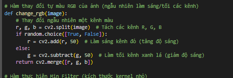

-----
Hàm Bộ Lọc Min và Max

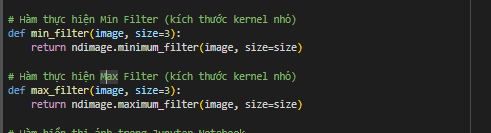

-----
 Hàm chính tạo menu và thực hiện biến đổi ảnh

 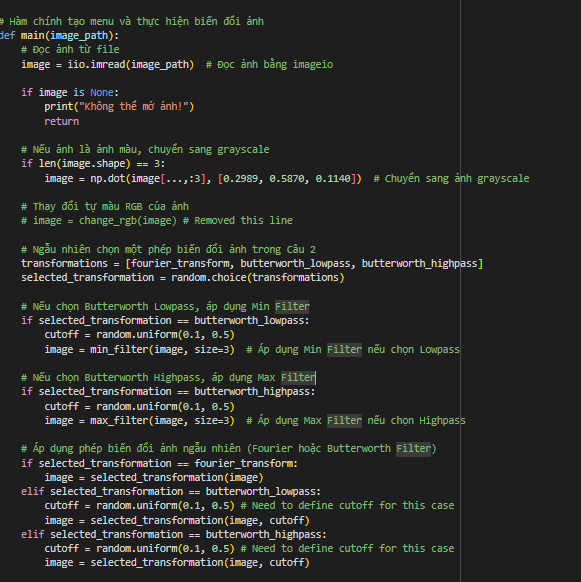

Hàm chính cho phép người dùng chọn các phép biến đổi ảnh và hiển thị kết quả.

----
Kết quả:
Chọn ảnh quang_ninh.jpg để thực nghiệm

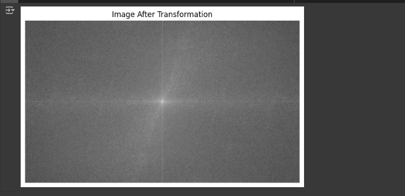

