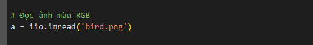

# THUC_HANH_NHAP_MON_XU_LY_ANH_SO
Phạm Thanh Sang - 2174802010561

3. Bài tập

Câu 1: Viết chương trình nạp một ảnh và lưu thành 3 ảnh với 3 màu khác nhau:

Nạp các thư viện cần thiết

numpy: Thư viện hỗ trợ xử lý ma trận (dữ liệu ảnh dưới dạng mảng số).

imageio.v2: Dùng để đọc và lưu ảnh từ file.

matplotlib.pyplot: Dùng để hiển thị ảnh.

Đọc ảnh 'bird.png' từ file và lưu vào biến a (dưới dạng mảng 3 chiều: cao x rộng x 3 kênh màu RGB).

Tạo 3 bản sao của ảnh gốc để xử lý từng kênh màu Đỏ (Red), Xanh lá (Green) và Xanh dương (Blue).

Giữ lại kênh Red, đặt giá trị kênh Green và Blue bằng 0.

Giữ lại kênh Green, đặt giá trị kênh Red và Blue bằng 0.

Giữ lại kênh Blue, đặt giá trị kênh Red và Green bằng 0.

Lưu từng ảnh với kênh màu riêng vào file mới (bird_red.png, bird_green.png, bird_blue.png).

Tạo khung hiển thị ảnh với kích thước 10x5 inch.

Hiển thị ảnh kênh Red trong ô thứ nhất, tắt trục tọa độ.

Hiển thị ảnh kênh Green và Blue 

Kết quả:

Ảnh gốc: Là ảnh màu bird.png có đầy đủ 3 kênh màu Red, Green và Blue.

Ảnh Red (bird_red.png):

Chỉ giữ lại kênh Red (màu đỏ) của ảnh gốc.

Các chi tiết ảnh chỉ hiện màu đỏ, các kênh xanh lá và xanh dương được loại bỏ (thành màu đen).

Ảnh Green (bird_green.png):

Chỉ giữ lại kênh Green (màu xanh lá) của ảnh gốc.

Các chi tiết ảnh chỉ hiện màu xanh lá, các kênh đỏ và xanh dương được loại bỏ (thành màu đen).

Ảnh Blue (bird_blue.png):

Chỉ giữ lại kênh Blue (màu xanh dương) của ảnh gốc.

Các chi tiết ảnh chỉ hiện màu xanh dương, các kênh đỏ và xanh lá được loại bỏ (thành màu đen).

Câu 2: Viết chương trinh nạp một ảnh và hoán đổi giá trị các màu. Lưu các ảnh vào máy

import các thư viện cần thiết

numpy: Xử lý mảng dữ liệu ảnh.

imageio.v2: Đọc và ghi ảnh từ file.

matplotlib.pyplot: Hiển thị ảnh.

Đọc ảnh

Hoán đổi kênh màu Red & Green:

copy() được dùng để sao chép dữ liệu gốc, tránh thay đổi ảnh ban đầu.

Đổi vị trí giá trị ở kênh 0 (Red) và 1 (Green) cho mọi pixel.

Kết quả: Màu đỏ và xanh lá của ảnh sẽ hoán đổi, tạo ra hiệu ứng màu sắc lạ.

Hoán đổi Green & Blue

Đổi vị trí giá trị kênh 1 (Green) và 2 (Blue).

Hoán đổi tất cả kênh (Red → Green, Green → Blue, Blue → Red)

Đổi vị trí toàn bộ kênh màu:

Kênh 0 (Red) lấy giá trị từ Blue,

Kênh 1 (Green) lấy giá trị từ Red,

Kênh 2 (Blue) lấy giá trị từ Green.

Lưu 3 ảnh kết quả với tên mới.

Tạo khung hình có kích thước 10x10 inch.
Hiển thị ảnh gốc

Hiển thị ảnh đã hoán đổi màu

Hiển thị toàn bộ hình ảnh

Kết quả:

1. Original Image (Ảnh gốc)

Đây là ảnh bird.png gốc, chứa đầy đủ 3 kênh màu Red (Đỏ), Green (Xanh lá) và Blue (Xanh dương).

2. Red & Green Swapped (bird_swapped_rg.png)

Kênh Red (Đỏ) và Green (Xanh lá) đã hoán đổi vị trí.

Vùngnào trong ảnh vốn màu đỏ sẽ trở thành xanh lá.

Vùng nào vốn màu xanh lá sẽ chuyển thành đỏ.

3. Green & Blue Swapped (bird_swapped_gb.png)

Kênh Green (Xanh lá) và Blue (Xanh dương) đã hoán đổi vị trí.

Vùng màu xanh lá trở thành xanh dương.

Vùng màu xanh dương trở thành xanh lá.

4. All Channels Swapped (bird_swapped_all.png)

Toàn bộ các kênh màu Red, Green, Blue bị hoán đổi theo thứ tự Red → Green, Green → Blue, Blue → Red.

Tất cả màu sắc sẽ bị thay đổi hoàn toàn, tạo nên hiệu ứng màu không tự nhiên và thú vị.

#Câu 3: Viết chương trình nạp một ảnh, chuyển thành hệ màu HSV và lưu 3 ảnh với 3 màu khác nhau.

Nạp các thư viện cần thiết

NumPy (numpy): Dùng để xử lý dữ liệu mảng số (ảnh).

ImageIO (imageio.v2): Dùng để nạp ảnh (imread) và lưu ảnh (imwrite) với định dạng .png, .jpg.

Matplotlib (matplotlib.pyplot): Hiển thị ảnh trực quan, so sánh giữa ảnh gốc và ảnh đã tách kênh.

Scikit-Image (skimage.color): Chuyển đổi hệ màu từ RGB (Red-Green-Blue) sang HSV (Hue-Saturation-Value).

Đọc ảnh

 Chuyển ảnh từ hệ màu RGB sang HSV

 

 Ảnh a được chuyển đổi từ hệ màu RGB (Red, Green, Blue) sang HSV (Hue, Saturation, Value) nhờ hàm rgb2hsv.

 H (Hue): Tông màu chính (0–1), ví dụ 0 = đỏ, 0.33 = xanh lá, 0.66 = xanh dương.

S (Saturation): Độ bão hòa màu (0–1), càng gần 1 màu càng rực rỡ.

V (Value): Độ sáng (0–1), càng gần 1 càng sáng.

Hue: Chứa thông tin màu chính.

Saturation: Chứa thông tin độ bão hòa.

Value: Chứa thông tin độ sáng.

Lưu từng kênh màu HSV thành ảnh riêng

Nhân với 255: Vì giá trị Hue, Saturation, Value gốc nằm trong khoảng [0,1], ta nhân 255 để đưa về [0,255] để lưu ảnh 8-bit.

Chuyển kiểu dữ liệu (astype(np.uint8)): Đảm bảo dữ liệu hợp lệ để lưu dưới dạng ảnh PNG.

 Hiển thị ảnh gốc và từng kênh màu

Tạo khung hình kích thước lớn (10x10 inch).

Hiển thị ảnh gốc RGB

Hiển thị Hue với colormap 'hsv'

Hiển thị Saturation với colormap 'gray'

Hiển thị Value với colormap 'gray'

Sau đó plt.shpw Hiển thị toàn bộ hình ảnh

Kết quả:

Sau khi chạy, ta thu được 4 ảnh:

Original Image: Ảnh gốc RGB (tự nhiên).

Hue Channel (bird_hue.png):

Mỗi pixel biểu diễn tông màu chính (0–1).

Vùng đỏ → giá trị gần 0, vùng xanh → khoảng 0.33, vùng xanh dương → khoảng 0.66.

Colormap 'hsv' giúp ta nhìn thấy màu như bánh xe màu.

Saturation Channel (bird_saturation.png):

Hiển thị độ bão hòa màu (0–1).

Vùng màu đậm → sáng (giá trị cao), vùng nhạt/đen trắng → tối (giá trị thấp).

Colormap 'gray': sáng hơn = bão hòa hơn.

Value Channel (bird_value.png):

Hiển thị độ sáng (0–1).

Vùng sáng → pixel sáng hơn, vùng tối → pixel tối hơn.

Câu 4: Viết chương trình nạp ảnh, chuyển sang hệ màu HSV. Lưu ảnh mới với kênh Hnew = 1/3 Hold, Vnew = 3/4 Vold

Nạp các thư viện cần thiết

NumPy (numpy): Xử lý dữ liệu dạng mảng.

ImageIO (imageio.v2): Đọc và lưu ảnh định dạng PNG/JPG.

Scikit-Image (skimage.color): Chuyển đổi hệ màu RGB ↔ HSV.

Matplotlib (matplotlib.pyplot): Hiển thị ảnh trực quan.

Đọc ảnh

Chuyển từ RGB sang HSV

Hàm rgb2hsv chuyển ảnh từ hệ màu RGB sang HSV.

HSV là hệ màu dựa trên cách mắt người cảm nhận:

Hue (H): Tông màu (0–1)

Saturation (S): Độ bão hòa (0–1)

Value (V): Độ sáng (0–1)

Tách các kênh H, S, V

Biến đổi các kênh H và V

Biến đổi Hue (H): Giảm tông màu của toàn bộ ảnh, khiến màu sắc có xu hướng dịu hơn (giảm độ rực của màu gốc).

Biến đổi Value (V): Giảm độ sáng, làm ảnh tối hơn.

Đảm bảo giá trị Hnew và Vnew nằm trong [0, 1]

Hàm np.clip giữ giá trị nằm trong khoảng [0,1] để ảnh hợp lệ.

Tạo ảnh HSV mới và chuyển về RGB

Ghép kênh Hnew, S, Vnew tạo ảnh HSV mới.

Chuyển ảnh HSV trở lại RGB để có thể hiển thị và lưu.

Lưu ảnh mới

Nhân a_rgb_new với 255 để chuyển về khoảng [0,255].

Chuyển kiểu dữ liệu về uint8 để lưu ảnh PNG.

Hiển thị ảnh gốc và ảnh đã biến đổi

Kết quả

Ảnh bên trái: ảnh gốc RGB.

Ảnh bên phải: ảnh đã biến đổi với kênh H = 1/3 H và V = 3/4 V.